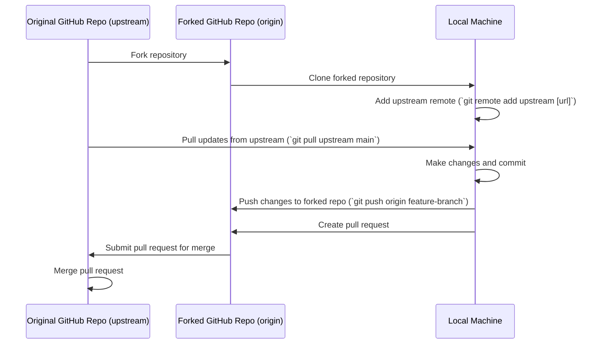

# Workflow Diagram Using Mermaid.js

```mermaid
sequenceDiagram
    participant Upstream as Original GitHub Repo (upstream)
    participant Origin as Forked GitHub Repo (origin)
    participant Local as Local Machine

    Upstream ->> Origin: Fork repository
    Origin ->> Local: Clone forked repository
    Local ->> Local: Add upstream remote (`git remote add upstream [url]`)
    Upstream ->> Local: Pull updates from upstream (`git pull upstream main`)
    Local ->> Local: Make changes and commit
    Local ->> Origin: Push changes to forked repo (`git push origin feature-branch`)
    Local ->> Origin: Create pull request
    Origin ->> Upstream: Submit pull request for merge
    Upstream ->> Upstream: Merge pull request
```
